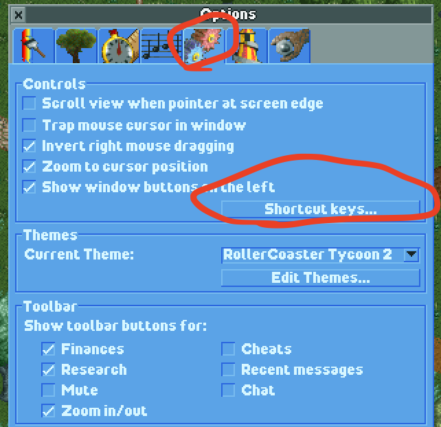

# enjoyable-mappings

Ever wanted to play games on macOS with a controller? 🎮 You can using [Enjoyable](https://yukkurigames.com/enjoyable/)!

If you enjoy the same games as me, you can download custom mappings for Xinput controllers below.
Once you've installed Enjoyable, open `.enjoyable` files to import them as profiles,
or use `⌘` + `O` in the Enjoyable UI.

## OpenRCT2 (Roller Coaster Tycoon)

My custom mappings for [OpenRCT2](https://openrct2.org/) use the following keyboard shortcuts under the hood.
Verify that you have the same shortcuts configured in the game by selecting
`Disk and game options` > `Options` > `Controls and interface` > `Shortcut keys...`:

Then, verify that you have the following shortcuts configured:

Finally, import these Enjoyable profiles to setup the custom mappings described below:

- [OpenRCT2](https://raw.githubusercontent.com/mxskylar/enjoyable-mappings/main/OpenRCT2.enjoyable)
- [OpenRCT2 Brown Menu](https://github.com/mxskylar/enjoyable-mappings/blob/main/OpenRCT2%20Brown%20Menu.enjoyable)
- [OpenRCT2 Gray Menu](https://github.com/mxskylar/enjoyable-mappings/blob/main/OpenRCT2%20Gray%20Menu.enjoyable)
- [OpenRCT2 Scroll](https://github.com/mxskylar/enjoyable-mappings/blob/main/OpenRCT2%20Scroll.enjoyable)

