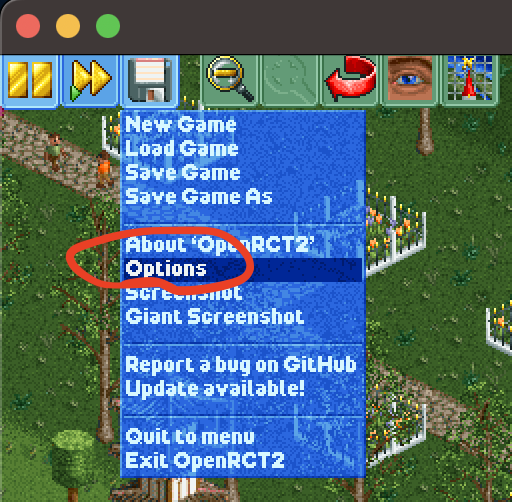
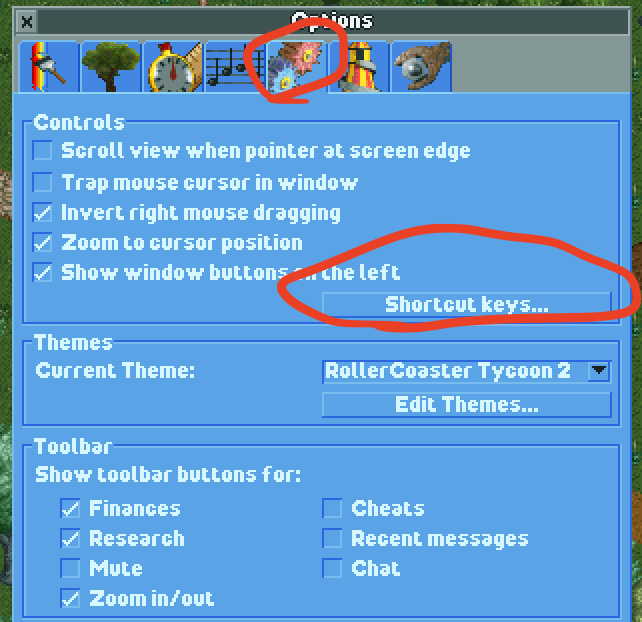
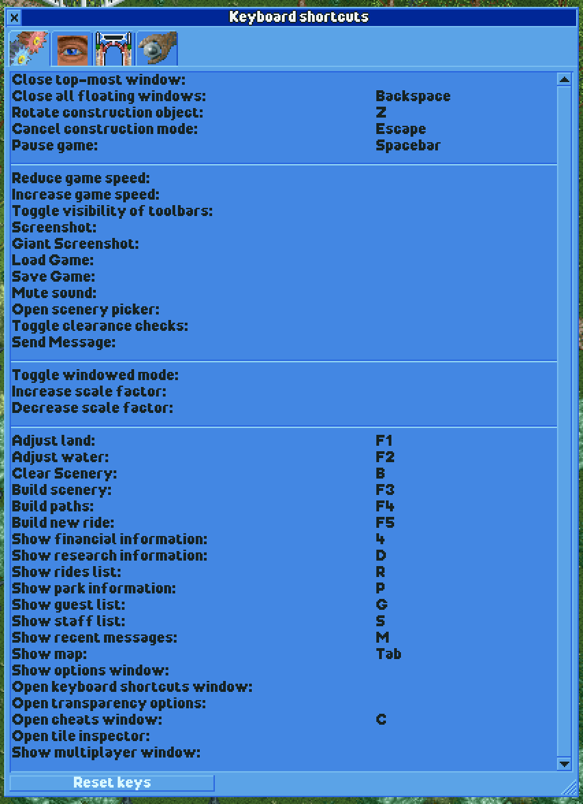

# OpenRCT2 (Roller Coaster Tycoon)

[Controller mappings](..) for [OpenRCT2](https://openrct2.org/) use the following keyboard shortcuts under the hood.
First, verify that you have the same shortcuts configured in the game by selecting
`Disk and game options` > `Options` > `Controls and interface` > `Shortcut keys...`

Then, verify that you have the following shortcuts configured:

Finally, import these Enjoyable profiles:

- [OpenRCT2](https://raw.githubusercontent.com/mxskylar/enjoyable-mappings/main/OpenRCT2.enjoyable)
- [OpenRCT2 Brown Menu](https://github.com/mxskylar/enjoyable-mappings/blob/main/OpenRCT2%20Brown%20Menu.enjoyable)
- [OpenRCT2 Gray Menu](https://github.com/mxskylar/enjoyable-mappings/blob/main/OpenRCT2%20Gray%20Menu.enjoyable)
- [OpenRCT2 Scroll](https://github.com/mxskylar/enjoyable-mappings/blob/main/OpenRCT2%20Scroll.enjoyable)

These profiles will map [Xinput controller keys]() like so:

